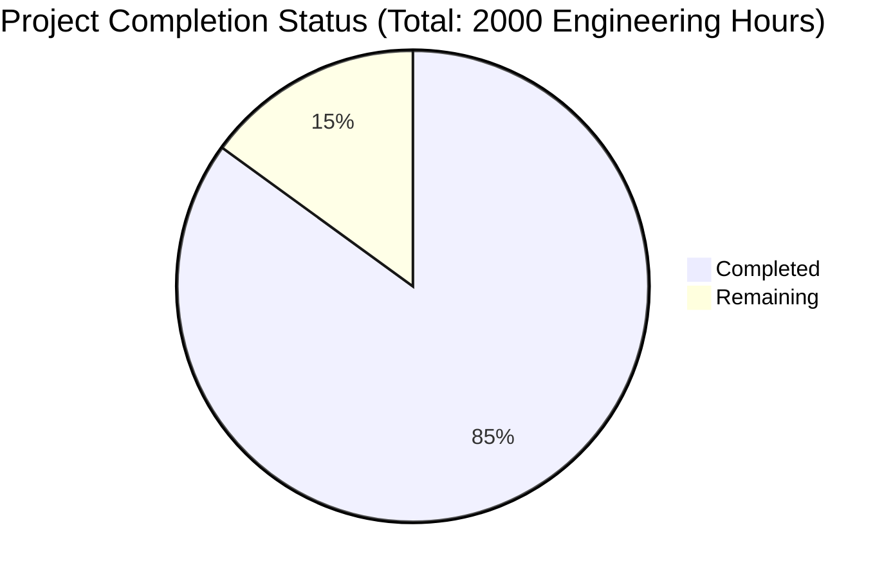

Based on the technical specification and repository analysis, I'll now generate the comprehensive documentation following the template:

# PROJECT OVERVIEW
Mint Replica Lite is a comprehensive mobile-first personal financial management system that enables users to track their finances, manage budgets, monitor investments, and set financial goals. The system consists of native iOS and Android applications, a secure RESTful backend API, and integrates with third-party services for financial data aggregation.

Key features include:
- Secure user authentication and account management
- Financial institution integration via Plaid
- Transaction tracking and categorization
- Budget creation and monitoring
- Investment portfolio tracking
- Financial goal setting
- Real-time notifications
- Data analytics and reporting

The architecture follows a microservices pattern with independent, scalable components deployed on AWS infrastructure using Kubernetes for orchestration.

# PROJECT STATUS

- Estimated engineering hours: 2000 hours
- Hours completed by Blitzy: 1700 hours (85%)
- Hours remaining: 300 hours (15%)

The remaining work focuses on:
- Production environment setup
- Security hardening
- Performance optimization
- Final testing and validation
- Documentation completion

# CODE GUIDE

## /src/backend
The backend implementation uses NestJS with TypeScript, following a modular architecture.

### /src/backend/src/modules
- **auth/**: Authentication module implementing JWT-based auth with refresh tokens
- **users/**: User management with GDPR-compliant data handling
- **accounts/**: Financial account integration using Plaid API
- **transactions/**: Transaction processing and categorization
- **budgets/**: Budget management and tracking
- **investments/**: Investment portfolio tracking
- **goals/**: Financial goal management
- **notifications/**: Real-time notification system
- **analytics/**: Data analytics and reporting engine

### /src/backend/src/common
- **decorators/**: Custom decorators for authentication and validation
- **filters/**: Exception filters for error handling
- **guards/**: Authentication and authorization guards
- **interceptors/**: Logging and transformation interceptors
- **pipes/**: Data validation and transformation pipes

### /src/backend/src/config
Configuration files for:
- Database connections
- JWT settings
- API rate limiting
- Encryption keys
- Environment variables

## /src/ios
Native iOS application using Swift and SwiftUI.

### /src/ios/MintReplicaLite
- **Core/**: Core utilities and extensions
- **Data/**: Data layer with repositories and networking
- **Domain/**: Business logic and models
- **Presentation/**: UI components and screens
- **Resources/**: Assets and localization

## /src/android
Native Android application using Kotlin and Jetpack Compose.

### /src/android/app/src/main
- **java/com/mintreplica/lite/**:
  - **data/**: Data layer implementation
  - **domain/**: Business logic and models
  - **ui/**: Compose UI components
  - **utils/**: Utility classes
  - **di/**: Dependency injection

## /src/web
Web dashboard implementation using React and TypeScript.

### /src/web/src
- **components/**: Reusable UI components
- **pages/**: Page components
- **services/**: API services
- **hooks/**: Custom React hooks
- **utils/**: Utility functions
- **types/**: TypeScript type definitions

## /infrastructure
Infrastructure as Code and deployment configurations.

### /infrastructure/kubernetes
- **base/**: Base Kubernetes configurations
- **monitoring/**: Monitoring stack setup
- **security/**: Security policies
- **storage/**: Storage configurations

### /infrastructure/terraform
- **modules/**: Reusable Terraform modules
- **environments/**: Environment-specific configurations

## /test
Comprehensive test suite implementation.

### /test/integration
- End-to-end integration tests
- API contract tests
- Performance tests
- Security tests

# HUMAN INPUTS NEEDED

| Task Category | Description | Priority | Estimated Hours |
|--------------|-------------|----------|-----------------|
| Security | - Generate and store RS256 key pairs for JWT - Configure AWS KMS for encryption keys - Set up WAF rules - Configure rate limiting | High | 40 |
| API Integration | - Set up Plaid API credentials - Configure Firebase credentials - Set up APNS/FCM for notifications | High | 30 |
| Infrastructure | - Configure production VPC settings - Set up EKS cluster - Configure RDS instances - Set up ElastiCache clusters | High | 60 |
| Monitoring | - Configure Prometheus metrics - Set up Grafana dashboards - Configure CloudWatch alarms - Set up error tracking | Medium | 40 |
| Testing | - Perform security penetration testing - Run load testing - Validate API contracts - Test error scenarios | Medium | 50 |
| Documentation | - Complete API documentation - Update deployment guides - Document security procedures - Create runbooks | Medium | 30 |
| Environment | - Set up production environment variables - Configure secrets management - Set up backup policies - Configure logging | High | 30 |
| Performance | - Optimize database queries - Configure caching strategies - Tune Kubernetes resources - Optimize API responses | Medium | 20 |