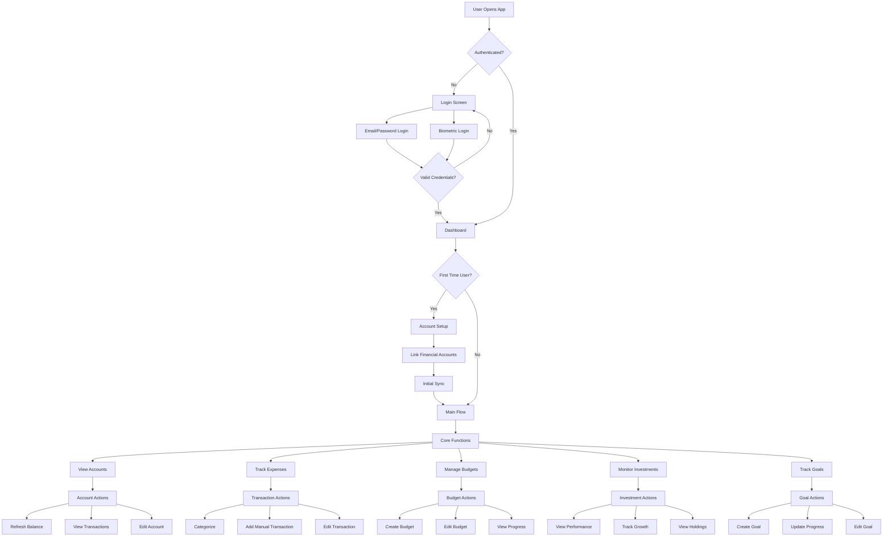
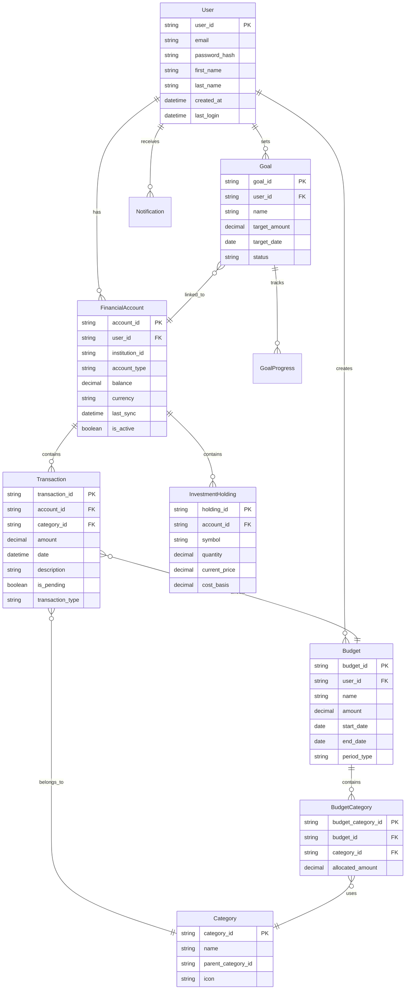
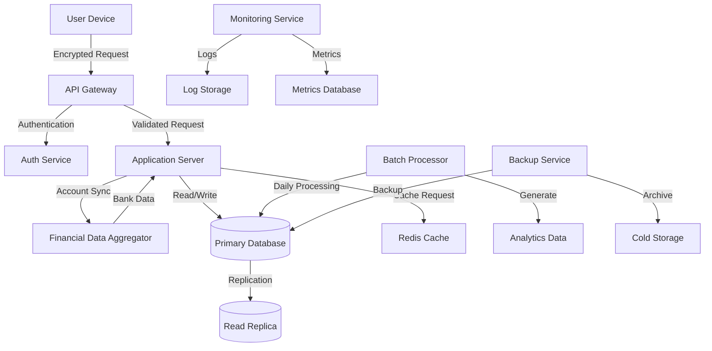

# 1. Introduction

## 1.1 Purpose
This Software Requirements Specification (SRS) document provides a comprehensive description of the implementation requirements for the Mint Replica Lite personal financial management application. It is intended for use by:
- Development teams responsible for implementing the system
- Quality assurance teams performing testing and validation
- Project managers overseeing the development process
- Stakeholders evaluating technical requirements and specifications

## 1.2 Scope
Mint Replica Lite is a streamlined personal financial management application that enables users to monitor and manage their financial health through a mobile-first platform. The system will:

- Provide secure account aggregation and transaction synchronization from financial institutions
- Deliver core financial management capabilities including expense tracking, budgeting, and goal setting
- Offer basic investment account monitoring and performance tracking
- Present financial data through an intuitive mobile interface
- Ensure data security and privacy compliance
- Support cross-platform deployment on iOS and Android devices

The application focuses on essential financial management features while maintaining simplicity and ease of use. It excludes advanced features like bill pay, credit score monitoring, and complex investment analysis to deliver a focused core experience.

# 2. Product Description

## 2.1 Product Perspective
Mint Replica Lite operates as a standalone mobile application that interfaces with external financial institutions through secure API integrations. The system consists of:

- Mobile applications for iOS and Android platforms
- Backend server infrastructure for data processing and storage
- Third-party financial data aggregation service integration
- Secure cloud database for user data storage
- Authentication and security services

The application functions independently but relies on external systems for financial data aggregation and user authentication.

## 2.2 Product Functions
The core functions of Mint Replica Lite include:

- User account creation and authentication with biometric support
- Financial account aggregation and synchronization
- Transaction tracking and categorization
- Budget creation and monitoring
- Basic investment account tracking
- Financial goal setting and progress monitoring
- Dashboard visualization of financial metrics
- Data export capabilities
- Account alerts and notifications

## 2.3 User Characteristics
The application targets the following user personas:

1. Primary Users:
   - Young professionals (25-40 years old)
   - Basic to intermediate financial literacy
   - Comfortable with mobile technology
   - Managing multiple financial accounts
   - Basic investment experience

2. Secondary Users:
   - College students and recent graduates
   - Limited financial experience
   - Tech-savvy
   - Beginning to establish financial accounts
   - New to investing

## 2.4 Constraints

1. Technical Constraints:
   - Mobile platform limitations (iOS and Android)
   - Network connectivity requirements
   - Device storage capacity
   - Third-party API limitations
   - Mobile device security boundaries

2. Regulatory Constraints:
   - Financial data protection regulations
   - Privacy laws and requirements
   - Banking industry compliance standards
   - Data retention policies

3. Business Constraints:
   - Development timeline and budget
   - Third-party service costs
   - Mobile platform distribution requirements
   - Support resource limitations

## 2.5 Assumptions and Dependencies

Assumptions:
- Users have consistent internet connectivity
- Users possess basic financial literacy
- Users have at least one financial account to track
- Mobile devices support required security features
- Third-party financial data remains accessible

Dependencies:
- Third-party financial data aggregation service availability
- Banking institution API stability
- Mobile platform update compatibility
- Cloud infrastructure reliability
- Authentication service availability
- Regulatory compliance requirements remaining stable

# 3. Process Flowchart



# 4. Functional Requirements

## 4.1 Account Management

| ID | Description | Priority |
|---|---|---|
| ACC-1 | Users shall be able to create accounts using email and password | High |
| ACC-2 | System shall support biometric authentication on compatible devices | Medium |
| ACC-3 | Users shall be able to reset passwords through email verification | High |
| ACC-4 | System shall enforce strong password requirements | High |
| ACC-5 | Users shall be able to update their profile information | Low |

## 4.2 Financial Account Integration

| ID | Description | Priority |
|---|---|---|
| FIN-1 | System shall connect to major banks through secure API integration | High |
| FIN-2 | System shall support daily synchronization of account balances | High |
| FIN-3 | Users shall be able to manually add accounts not available for automatic linking | Medium |
| FIN-4 | System shall detect and alert users of synchronization failures | Medium |
| FIN-5 | Users shall be able to remove linked accounts | High |

## 4.3 Transaction Management

| ID | Description | Priority |
|---|---|---|
| TRN-1 | System shall automatically categorize incoming transactions | High |
| TRN-2 | Users shall be able to manually recategorize transactions | High |
| TRN-3 | System shall support manual transaction entry | Medium |
| TRN-4 | Users shall be able to split transactions across multiple categories | Low |
| TRN-5 | System shall maintain transaction history for at least 12 months | Medium |

## 4.4 Budgeting

| ID | Description | Priority |
|---|---|---|
| BUD-1 | Users shall be able to create category-based budgets | High |
| BUD-2 | System shall track budget progress in real-time | High |
| BUD-3 | Users shall receive notifications when approaching budget limits | Medium |
| BUD-4 | System shall support monthly and custom period budgets | Medium |
| BUD-5 | Users shall be able to roll over unused budget amounts | Low |

## 4.5 Investment Tracking

| ID | Description | Priority |
|---|---|---|
| INV-1 | System shall display current balances for investment accounts | High |
| INV-2 | System shall track basic investment performance metrics | High |
| INV-3 | Users shall be able to view investment transaction history | Medium |
| INV-4 | System shall categorize investment transactions by type | Medium |
| INV-5 | System shall calculate simple return on investment metrics | Low |

## 4.6 Goal Management

| ID | Description | Priority |
|---|---|---|
| GOL-1 | Users shall be able to create financial goals with target amounts | High |
| GOL-2 | System shall track progress towards financial goals | High |
| GOL-3 | Users shall be able to link specific accounts to goals | Medium |
| GOL-4 | System shall provide goal completion estimates | Medium |
| GOL-5 | Users shall receive notifications for goal milestones | Low |

## 4.7 Dashboard and Reporting

| ID | Description | Priority |
|---|---|---|
| DSH-1 | System shall display account balances and net worth | High |
| DSH-2 | System shall show recent transactions | High |
| DSH-3 | Users shall be able to view spending trends by category | Medium |
| DSH-4 | System shall generate basic financial reports | Medium |
| DSH-5 | Users shall be able to export financial data in CSV format | Low |

## 4.8 Notifications

| ID | Description | Priority |
|---|---|---|
| NOT-1 | System shall send budget alerts | High |
| NOT-2 | System shall notify users of large or suspicious transactions | High |
| NOT-3 | Users shall receive account sync status notifications | Medium |
| NOT-4 | System shall send goal progress updates | Medium |
| NOT-5 | Users shall be able to customize notification preferences | Low |

# 5. Non-Functional Requirements

## 5.1 Performance

| Requirement | Description | Target Metric |
|-------------|-------------|---------------|
| Response Time | Maximum time for screen transitions and data loading | < 3 seconds |
| API Response | Maximum time for third-party API calls | < 5 seconds |
| Data Sync | Maximum time for daily account synchronization | < 10 minutes |
| App Launch | Time from launch to dashboard display | < 4 seconds |
| Memory Usage | Maximum app memory consumption | < 200MB |
| Battery Impact | Maximum battery consumption per day | < 5% of device battery |

## 5.2 Safety

| Requirement | Description |
|-------------|-------------|
| Data Backup | Automated daily backups of all user data with 30-day retention |
| Failure Recovery | Automatic system recovery with data rollback capabilities |
| Error Handling | Graceful degradation of services during partial system failures |
| Data Validation | Input validation and sanitization for all user-entered data |
| Session Management | Automatic session termination after 15 minutes of inactivity |
| Disaster Recovery | Recovery Point Objective (RPO) of 24 hours and Recovery Time Objective (RTO) of 4 hours |

## 5.3 Security

| Requirement | Description |
|-------------|-------------|
| Data Encryption | AES-256 encryption for data at rest and TLS 1.3 for data in transit |
| Authentication | Multi-factor authentication with biometric support |
| Authorization | Role-based access control with principle of least privilege |
| Password Policy | Minimum 12 characters with complexity requirements |
| Session Security | Secure session management with JWT tokens |
| API Security | OAuth 2.0 implementation for third-party API access |
| Audit Logging | Comprehensive logging of all security-related events |

## 5.4 Quality

### 5.4.1 Availability
- System uptime: 99.9% excluding scheduled maintenance
- Maximum planned downtime: 4 hours per month
- Unplanned downtime resolution: < 2 hours

### 5.4.2 Maintainability
- Modular architecture supporting independent component updates
- Automated deployment processes
- Comprehensive system documentation
- Code coverage minimum: 80%

### 5.4.3 Usability
- Maximum 3 clicks to reach any feature
- Intuitive navigation with consistent UI patterns
- Support for accessibility standards (WCAG 2.1 Level AA)
- Multi-language support for major languages

### 5.4.4 Scalability
- Support for 100,000 concurrent users
- Linear performance scaling up to 1 million users
- Horizontal scaling capability for all system components
- Auto-scaling based on load metrics

### 5.4.5 Reliability
- Mean Time Between Failures (MTBF): > 720 hours
- Mean Time To Recovery (MTTR): < 1 hour
- Error rate: < 0.1% of all transactions
- Data accuracy: 99.99% for financial calculations

## 5.5 Compliance

| Requirement | Description |
|-------------|-------------|
| Data Protection | GDPR and CCPA compliance for user data handling |
| Financial Regulations | Compliance with relevant banking regulations and standards |
| Security Standards | SOC 2 Type II compliance |
| Privacy | Implementation of Privacy by Design principles |
| Data Retention | Compliance with regional data retention requirements |
| Audit Trail | Maintenance of complete audit trails for all financial transactions |
| Reporting | Generation of compliance reports for regulatory requirements |

# 6. Data Requirements

## 6.1 Data Models



## 6.2 Data Storage

### 6.2.1 Data Retention
- Active transaction data: 24 months rolling retention
- Archived transaction data: 7 years with compressed storage
- User account data: Retained until account deletion plus 30 days
- Investment history: 5 years rolling retention
- System logs: 90 days active storage, 1 year archived

### 6.2.2 Redundancy
- Primary database: Real-time replication across multiple availability zones
- Read replicas: Minimum of 2 replicas per region
- Cross-region backup: Secondary region failover capability
- Data synchronization: Real-time with maximum 5-minute lag tolerance

### 6.2.3 Backup
- Full database backups: Daily
- Incremental backups: Every 6 hours
- Transaction logs: Continuous backup with 5-minute point-in-time recovery
- Backup retention: 30 days for daily backups, 7 days for incremental
- Backup encryption: AES-256 encryption at rest

### 6.2.4 Recovery
- Recovery Time Objective (RTO): 4 hours
- Recovery Point Objective (RPO): 15 minutes
- Automated recovery procedures for common failure scenarios
- Geographic failover capability within 1 hour

## 6.3 Data Processing

### 6.3.1 Security Controls
- End-to-end encryption for all financial data
- Field-level encryption for sensitive data elements
- Tokenization of account numbers and credentials
- Data masking for non-privileged access
- Secure key rotation every 90 days

### 6.3.2 Data Flow



### 6.3.3 Processing Requirements
- Real-time transaction categorization
- Daily account balance reconciliation
- Investment performance calculations every 4 hours during market hours
- Budget status updates within 30 seconds of new transactions
- Goal progress recalculation every 6 hours
- Notification processing within 1 minute of trigger events

# 7. External Interfaces

## 7.1 User Interfaces

### 7.1.1 Mobile Application Interface Requirements

| Screen | Key Elements | Requirements |
|--------|--------------|--------------|
| Login | - Email/password fields<br>- Biometric login option<br>- Password reset link | - Clean, minimalist design<br>- Clear error messaging<br>- Maximum 2-step authentication process |
| Dashboard | - Account balances<br>- Recent transactions<br>- Budget status<br>- Goal progress | - Card-based layout<br>- Pull-to-refresh functionality<br>- Quick action buttons |
| Account Details | - Transaction list<br>- Search/filter options<br>- Account settings | - Infinite scroll for transactions<br>- Quick categorization actions<br>- Transaction details on tap |
| Budget View | - Category breakdown<br>- Progress bars<br>- Spending alerts | - Visual progress indicators<br>- Color-coded status<br>- Category grouping |
| Investment Summary | - Account balances<br>- Performance metrics<br>- Holdings list | - Performance graphs<br>- Asset allocation charts<br>- Return calculations |
| Goals | - Goal progress<br>- Target dates<br>- Contribution tracking | - Progress visualization<br>- Timeline display<br>- Milestone markers |

### 7.1.2 Design Guidelines

- Material Design 3 components for Android
- iOS Human Interface Guidelines compliance for iOS
- Consistent 16sp base font size
- Primary color palette with financial-appropriate tones
- Accessibility compliance with WCAG 2.1 Level AA
- Dark mode support
- Responsive layouts for different screen sizes

## 7.2 Hardware Interfaces

### 7.2.1 Mobile Device Requirements

| Component | Specification |
|-----------|--------------|
| Minimum Screen Size | 4.7 inches |
| Minimum Resolution | 1334 x 750 pixels |
| Biometric Hardware | Fingerprint sensor or Face ID compatible |
| Camera | Required for document scanning |
| Storage | Minimum 100MB free space |
| RAM | Minimum 2GB |

### 7.2.2 Hardware Integration Points

- Biometric sensor API integration for authentication
- Camera API access for document scanning
- Local storage access for caching
- Network hardware for data synchronization
- Push notification hardware support

## 7.3 Software Interfaces

### 7.3.1 External Service Integration

| Service | Purpose | Interface Type |
|---------|----------|---------------|
| Plaid API | Financial account aggregation | RESTful API |
| Firebase | Authentication and analytics | SDK |
| Cloud Storage | Data backup and sync | API |
| Push Notification Service | User alerts | FCM/APNS |
| Analytics Platform | Usage tracking | SDK |

### 7.3.2 Operating System Integration

- iOS 14.0+ compatibility
- Android 8.0+ compatibility
- Native sharing framework integration
- Calendar integration for financial reminders
- Contact integration for P2P transfers

## 7.4 Communication Interfaces

### 7.4.1 Network Protocols

| Protocol | Usage | Specification |
|----------|--------|---------------|
| HTTPS | API Communication | TLS 1.3 |
| WebSocket | Real-time updates | WSS Protocol |
| REST | API Architecture | JSON/HTTP |
| gRPC | High-performance services | Protocol Buffers |

### 7.4.2 Data Exchange Formats

```json
{
  "transaction": {
    "id": "string",
    "amount": "decimal",
    "date": "ISO8601",
    "category": "string",
    "description": "string",
    "account_id": "string"
  }
}
```

### 7.4.3 API Requirements

- Rate limiting: 100 requests per minute per user
- Response time: < 200ms for 95th percentile
- Batch processing capability for bulk operations
- Pagination support for large datasets
- Compression for response payloads
- OAuth 2.0 authentication flow

# APPENDICES

## A.1 GLOSSARY

| Term | Definition |
|------|------------|
| Financial Data Aggregation | The process of collecting and consolidating financial account information from multiple sources into a single view |
| Net Worth | The total value of a user's assets minus their liabilities |
| Transaction Categorization | The process of classifying financial transactions into predefined spending categories |
| Budget Category | A designated spending category used to track and manage expenses |
| Investment Holdings | The specific assets held within an investment account |
| Goal Progress | The measurement of advancement towards a defined financial target |
| Asset Allocation | The distribution of investments across different asset classes |
| Return on Investment (ROI) | The percentage gain or loss on an investment relative to its cost |

## A.2 ACRONYMS

| Acronym | Definition |
|---------|------------|
| API | Application Programming Interface |
| APNS | Apple Push Notification Service |
| AES | Advanced Encryption Standard |
| CCPA | California Consumer Privacy Act |
| FCM | Firebase Cloud Messaging |
| GDPR | General Data Protection Regulation |
| JWT | JSON Web Token |
| MTBF | Mean Time Between Failures |
| MTTR | Mean Time To Recovery |
| OAuth | Open Authorization |
| REST | Representational State Transfer |
| RPO | Recovery Point Objective |
| RTO | Recovery Time Objective |
| SDK | Software Development Kit |
| SOC | Service Organization Control |
| TLS | Transport Layer Security |
| UI | User Interface |
| WCAG | Web Content Accessibility Guidelines |
| WSS | WebSocket Secure |

## A.3 ADDITIONAL REFERENCES

| Reference | Description | URL |
|-----------|-------------|-----|
| Material Design 3 | Google's design system for Android | https://m3.material.io/ |
| iOS Human Interface Guidelines | Apple's design guidelines | https://developer.apple.com/design/human-interface-guidelines/ |
| Plaid API Documentation | Financial data aggregation service documentation | https://plaid.com/docs/ |
| Firebase Documentation | Authentication and analytics platform documentation | https://firebase.google.com/docs |
| OAuth 2.0 Specification | Authorization framework specification | https://oauth.net/2/ |
| WCAG 2.1 Guidelines | Web accessibility guidelines | https://www.w3.org/WAI/WCAG21/quickref/ |