# 1. Introduction

## 1.1 System Overview
Mint Replica Lite is a comprehensive mobile-first personal financial management system consisting of the following core components:

- Native mobile applications for iOS and Android platforms
- RESTful backend API service for data processing and business logic
- Secure cloud database infrastructure for user data storage
- Third-party integrations for financial data aggregation
- Real-time notification system for alerts and updates
- Analytics and reporting engine for financial insights
- Authentication and authorization services
- Automated backup and disaster recovery systems

The system architecture follows a microservices pattern with independent, scalable components communicating through secure API endpoints. Data flows are encrypted end-to-end using industry-standard protocols, while the mobile applications implement platform-specific design guidelines for optimal user experience.

## 1.2 Scope
The Mint Replica Lite system encompasses:

### Core Features
- Secure user authentication and account management
- Financial institution integration and account aggregation
- Transaction tracking and categorization
- Budget creation and monitoring
- Basic investment portfolio tracking
- Financial goal setting and progress monitoring
- Real-time notifications and alerts
- Data export and reporting capabilities

### Technical Implementation
- Cross-platform mobile applications using native development frameworks
- Cloud-based backend infrastructure with horizontal scaling
- Encrypted data storage with automated backup systems
- Third-party API integrations for financial data
- Real-time data synchronization
- Analytics and reporting engine
- Comprehensive security controls and monitoring

### Boundaries
The system explicitly excludes:
- Direct payment processing
- Bill pay functionality
- Credit score monitoring
- Advanced investment analysis tools
- Tax preparation features
- Financial advisory services
- Manual data entry of historical transactions beyond 90 days

# 5. System Architecture

## 5.1 High-Level Architecture Overview

```mermaid
flowchart TB
    subgraph Client Layer
        iOS[iOS App]
        Android[Android App]
    end

    subgraph API Gateway Layer
        AG[API Gateway]
        LB[Load Balancer]
    end

    subgraph Service Layer
        Auth[Authentication Service]
        Trans[Transaction Service]
        Budget[Budget Service]
        Invest[Investment Service]
        Goal[Goal Service]
        Notif[Notification Service]
        Sync[Data Sync Service]
    end

    subgraph Data Layer
        PDB[(Primary Database)]
        Cache[(Redis Cache)]
        Queue[(Message Queue)]
    end

    subgraph External Services
        Plaid[Plaid API]
        Push[Push Notification Services]
        Analytics[Analytics Platform]
    end

    iOS --> AG
    Android --> AG
    AG --> LB
    LB --> Auth
    LB --> Trans
    LB --> Budget
    LB --> Invest
    LB --> Goal
    LB --> Notif
    LB --> Sync

    Auth --> PDB
    Trans --> PDB
    Budget --> PDB
    Invest --> PDB
    Goal --> PDB
    Notif --> PDB
    Sync --> PDB

    Service Layer --> Cache
    Service Layer --> Queue

    Sync --> Plaid
    Notif --> Push
    Service Layer --> Analytics
```

## 5.2 Component Architecture

### 5.2.1 Mobile Applications
- Native iOS application using Swift and SwiftUI
- Native Android application using Kotlin and Jetpack Compose
- Shared business logic layer
- Local SQLite database for offline data
- Secure keychain integration for credential storage

### 5.2.2 API Gateway
- AWS API Gateway implementation
- Request routing and load balancing
- API versioning support
- Request/response transformation
- Rate limiting and throttling
- SSL/TLS termination

### 5.2.3 Service Layer Architecture

```mermaid
flowchart LR
    subgraph Core Services
        direction TB
        Auth[Authentication Service]
        Trans[Transaction Service]
        Budget[Budget Service]
        Invest[Investment Service]
        Goal[Goal Service]
    end

    subgraph Support Services
        direction TB
        Notif[Notification Service]
        Sync[Data Sync Service]
        Analytics[Analytics Service]
        Audit[Audit Service]
    end

    subgraph Infrastructure Services
        direction TB
        Cache[Caching Service]
        Queue[Message Queue]
        Log[Logging Service]
        Monitor[Monitoring Service]
    end

    Core Services --> Infrastructure Services
    Support Services --> Infrastructure Services
    Core Services <--> Support Services
```

### 5.2.4 Data Architecture

```mermaid
flowchart TB
    subgraph Primary Storage
        Master[(Primary DB)]
        Replica1[(Read Replica 1)]
        Replica2[(Read Replica 2)]
        Master --> Replica1
        Master --> Replica2
    end

    subgraph Cache Layer
        RC1[Redis Cluster 1]
        RC2[Redis Cluster 2]
    end

    subgraph Queue System
        MQ1[Message Queue 1]
        MQ2[Message Queue 2]
    end

    subgraph Backup System
        Hot[Hot Backup]
        Warm[Warm Backup]
        Cold[Cold Storage]
        Hot --> Warm
        Warm --> Cold
    end

    Primary Storage --> Cache Layer
    Primary Storage --> Queue System
    Primary Storage --> Backup System
```

## 5.3 Technology Stack

### 5.3.1 Frontend Technologies
- iOS: Swift 5.5+, SwiftUI
- Android: Kotlin 1.5+, Jetpack Compose
- Shared: Kotlin Multiplatform Mobile

### 5.3.2 Backend Technologies
- Runtime: Node.js 16+ with TypeScript
- Framework: NestJS
- API: REST with OpenAPI 3.0
- Real-time: WebSocket with Socket.io

### 5.3.3 Data Storage
- Primary Database: PostgreSQL 14+
- Cache: Redis 6+
- Message Queue: RabbitMQ
- Object Storage: AWS S3

### 5.3.4 Infrastructure
- Cloud Platform: AWS
- Container Orchestration: Kubernetes
- CI/CD: GitHub Actions
- Monitoring: Prometheus & Grafana

## 5.4 Security Architecture

```mermaid
flowchart TB
    subgraph Security Layers
        direction TB
        L1[Network Security Layer]
        L2[Application Security Layer]
        L3[Data Security Layer]
        L4[Infrastructure Security Layer]
        
        L1 --> L2
        L2 --> L3
        L3 --> L4
    end

    subgraph Security Components
        direction LR
        WAF[Web Application Firewall]
        IAM[Identity & Access Management]
        Enc[Encryption Service]
        Audit[Audit Logging]
        
        WAF --> IAM
        IAM --> Enc
        Enc --> Audit
    end

    Security Layers <--> Security Components
```

## 5.5 Scalability Architecture

### 5.5.1 Horizontal Scaling
- Auto-scaling groups for application services
- Read replicas for database scaling
- Redis cluster for cache scaling
- Load balancer distribution

### 5.5.2 Vertical Scaling
- Configurable resource allocation
- Database instance sizing
- Cache memory optimization
- Queue processing capacity

## 5.6 Deployment Architecture

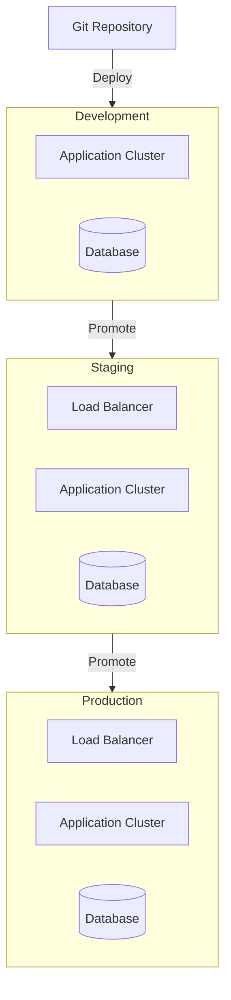

# 6. System Components Architecture

## 6.1 Component Diagrams

### 6.1.1 Core Application Components

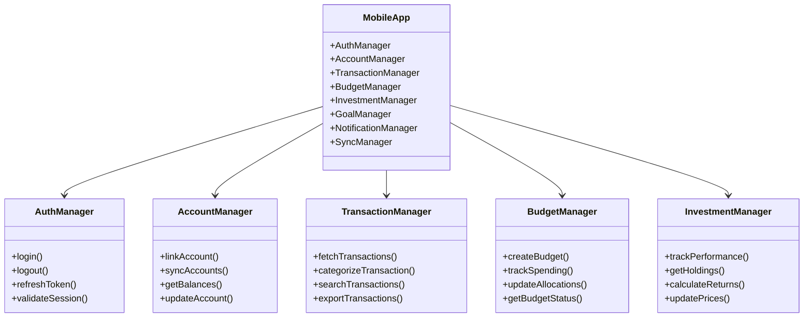

### 6.1.2 Backend Service Components

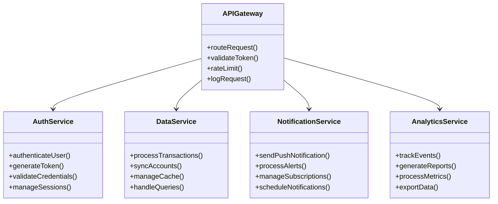

## 6.2 Sequence Diagrams

### 6.2.1 Account Synchronization Flow

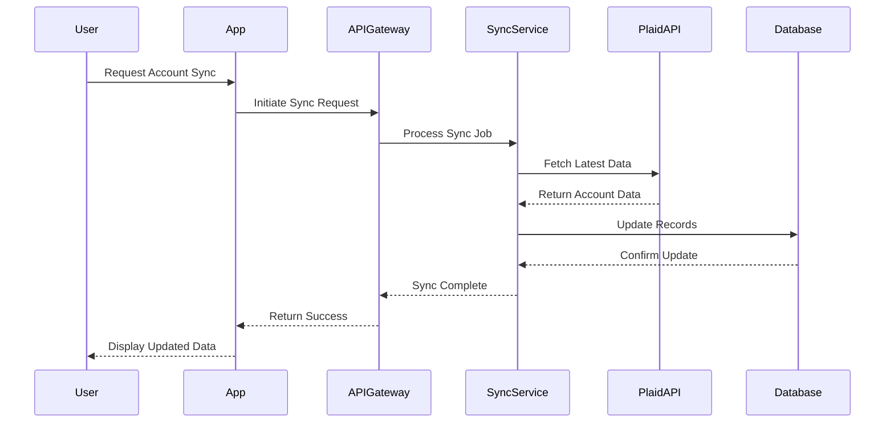

### 6.2.2 Transaction Processing Flow

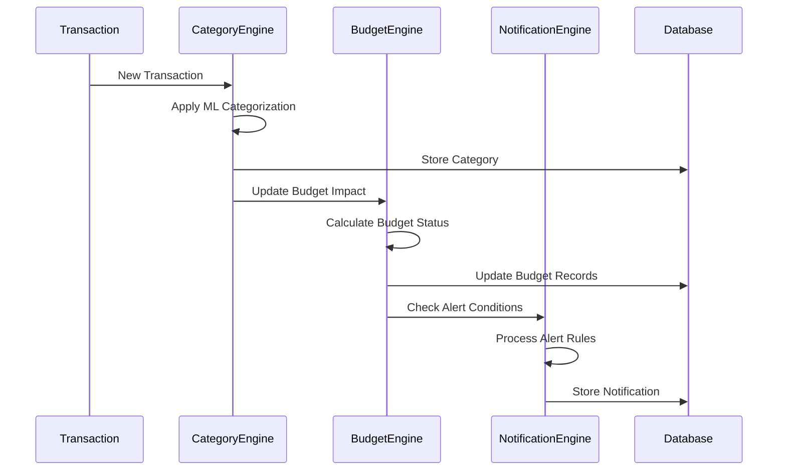

## 6.3 Data Flow Diagram

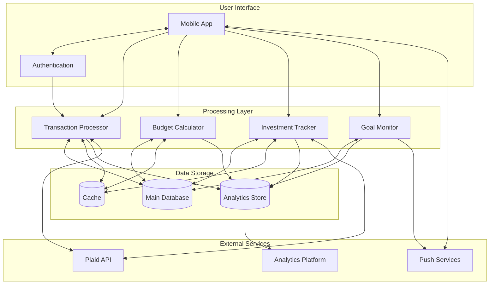

## 6.4 Component Dependencies

| Component | Dependencies | Purpose |
|-----------|--------------|---------|
| AuthManager | Firebase Auth SDK, Biometric APIs | User authentication and session management |
| AccountManager | Plaid SDK, SQLite | Financial account integration and local storage |
| TransactionManager | CategoryEngine, BudgetEngine | Transaction processing and categorization |
| BudgetEngine | NotificationEngine, Analytics SDK | Budget tracking and alerts |
| InvestmentManager | PriceEngine, Analytics SDK | Investment tracking and performance calculation |
| SyncManager | NetworkManager, CacheManager | Data synchronization and offline support |
| NotificationEngine | FCM/APNS, AlertManager | Push notification handling |
| AnalyticsService | Analytics SDK, LogManager | Usage tracking and reporting |

# 7. Technology Stack

## 7.1 Programming Languages

| Platform | Language | Version | Justification |
|----------|----------|---------|---------------|
| iOS | Swift | 5.5+ | Native performance, SwiftUI support, modern concurrency features |
| Android | Kotlin | 1.5+ | Official Android language, Jetpack Compose support, coroutines |
| Backend | TypeScript | 4.8+ | Type safety, modern ECMAScript features, excellent tooling |
| Infrastructure | TypeScript | 4.8+ | Shared types with backend, infrastructure as code support |
| Database Migrations | SQL | - | Native database schema management and versioning |

## 7.2 Frameworks and Libraries

### 7.2.1 Mobile Development

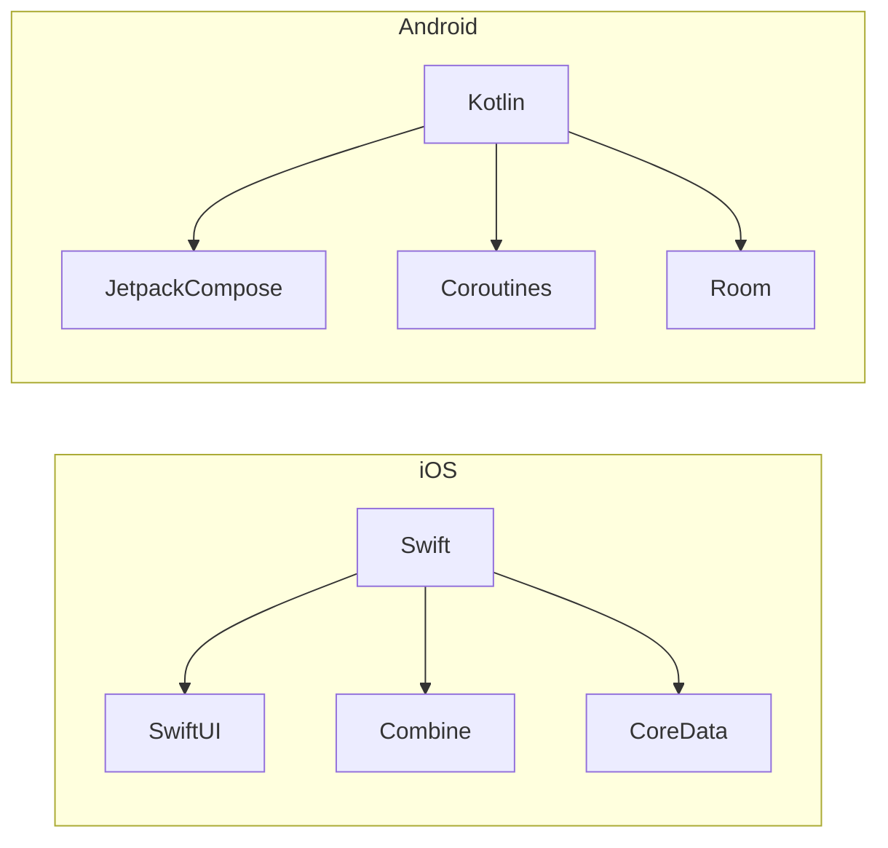

### 7.2.2 Backend Framework Stack

```mermaid
flowchart TB
    NestJS --> TypeScript
    TypeScript --> NodeJS
    
    subgraph Core Libraries
        direction LR
        TypeORM[TypeORM]
        Socket.io[Socket.io]
        OpenAPI[OpenAPI]
        JWT[JWT]
    end
    
    NestJS --> Core Libraries
```

| Category | Framework/Library | Version | Purpose |
|----------|------------------|---------|----------|
| Backend Framework | NestJS | 9.0+ | Scalable server-side architecture |
| API Documentation | OpenAPI | 3.0 | API specification and documentation |
| ORM | TypeORM | 0.3+ | Database operations and migrations |
| Real-time | Socket.io | 4.0+ | WebSocket communication |
| Authentication | Passport.js | 0.6+ | Authentication strategies |
| Validation | class-validator | 0.14+ | Input validation |
| Testing | Jest | 29.0+ | Unit and integration testing |

## 7.3 Databases

### 7.3.1 Primary Databases

| Database | Version | Purpose | Justification |
|----------|---------|---------|---------------|
| PostgreSQL | 14+ | Primary data store | ACID compliance, JSON support, robust transactions |
| Redis | 6+ | Caching, sessions | High performance, pub/sub capabilities |
| TimescaleDB | 2.8+ | Time-series data | Optimized for financial transaction history |

### 7.3.2 Database Architecture

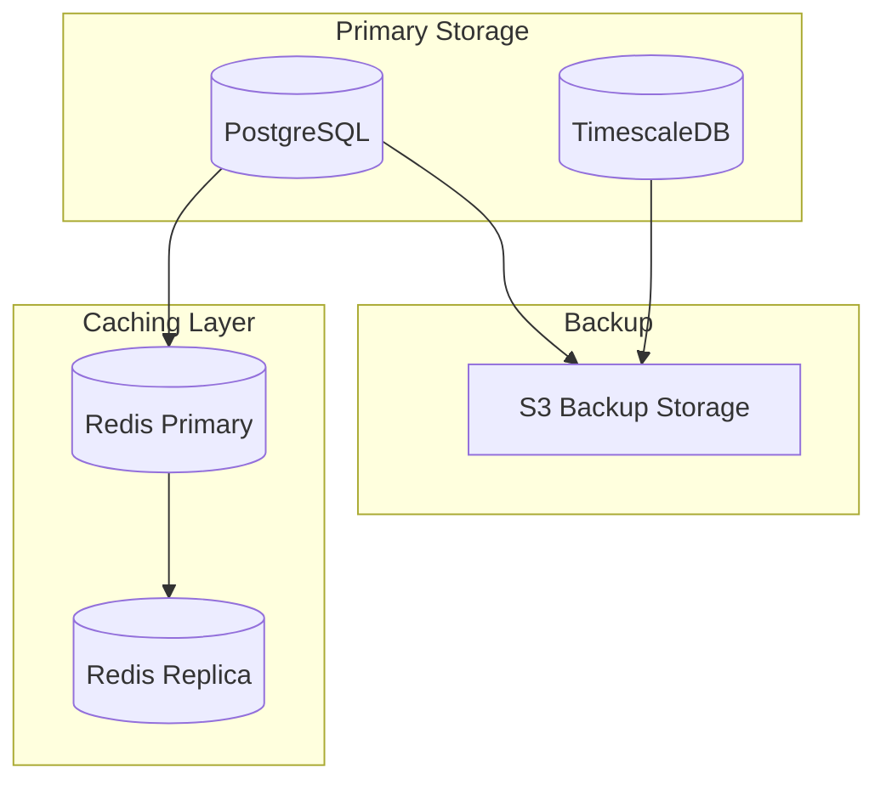

## 7.4 Third-Party Services

| Service | Purpose | Integration Method |
|---------|---------|-------------------|
| Plaid | Financial account aggregation | REST API |
| Firebase Auth | User authentication | SDK |
| AWS S3 | Object storage | SDK |
| AWS CloudFront | CDN | Direct |
| AWS SES | Email delivery | SDK |
| Firebase Cloud Messaging | Push notifications | SDK |
| Sentry | Error tracking | SDK |
| DataDog | Application monitoring | Agent |
| Stripe | Payment processing | SDK |

### 7.4.1 Service Integration Architecture

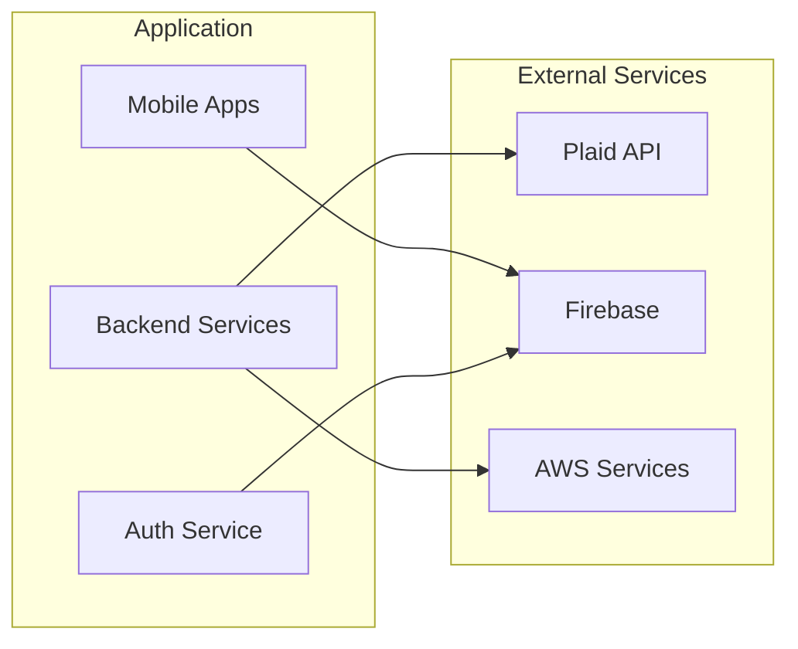

## 7.5 Development and Deployment Tools

| Category | Tool | Version | Purpose |
|----------|------|---------|----------|
| Containerization | Docker | 20.10+ | Application containerization |
| Container Orchestration | Kubernetes | 1.24+ | Container management |
| CI/CD | GitHub Actions | - | Automated deployment |
| Infrastructure as Code | AWS CDK | 2.0+ | Infrastructure management |
| API Testing | Postman | - | API development and testing |
| Monitoring | Prometheus | 2.40+ | Metrics collection |
| Logging | ELK Stack | 8.0+ | Log aggregation and analysis |
| Load Testing | k6 | 0.42+ | Performance testing |

# 8. System Design

## 8.1 User Interface Design

### 8.1.1 Mobile Navigation Structure

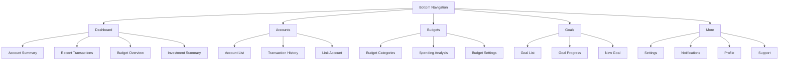

### 8.1.2 Screen Layouts

| Screen | Layout Components | Interactions |
|--------|------------------|--------------|
| Dashboard | - Account balance cards<br>- Transaction list<br>- Budget progress bars<br>- Investment summary card | - Pull to refresh<br>- Card tap navigation<br>- Horizontal scroll for cards |
| Account Details | - Balance header<br>- Transaction filters<br>- Transaction list<br>- Search bar | - Transaction categorization<br>- Infinite scroll<br>- Filter/sort options |
| Budget View | - Category breakdown<br>- Progress indicators<br>- Spending alerts<br>- Period selector | - Category drill-down<br>- Adjustment controls<br>- Alert management |
| Investment Dashboard | - Portfolio summary<br>- Holdings list<br>- Performance charts<br>- Asset allocation | - Holdings details<br>- Performance period selection<br>- Chart interactions |

## 8.2 Database Design

### 8.2.1 Schema Design

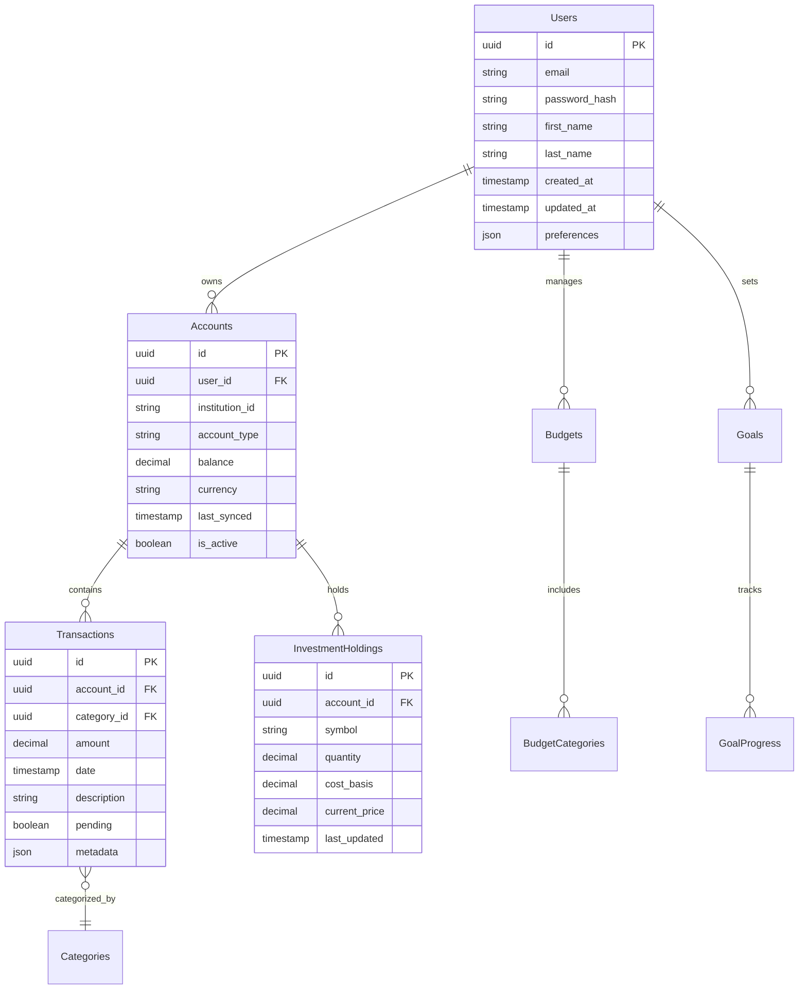

### 8.2.2 Indexing Strategy

| Table | Index | Type | Purpose |
|-------|-------|------|---------|
| Users | email_idx | UNIQUE | Email lookup for authentication |
| Transactions | account_date_idx | BTREE | Transaction history queries |
| Transactions | category_date_idx | BTREE | Category-based reporting |
| InvestmentHoldings | symbol_idx | BTREE | Symbol-based lookups |
| Accounts | user_active_idx | BTREE | Active account queries |

## 8.3 API Design

### 8.3.1 REST API Endpoints

| Endpoint | Method | Purpose | Request/Response |
|----------|--------|---------|------------------|
| `/api/v1/accounts` | GET | List user accounts | Response: `Account[]` |
| `/api/v1/accounts/{id}/transactions` | GET | Get account transactions | Response: `Transaction[]` |
| `/api/v1/budgets` | POST | Create budget | Request: `BudgetCreate`<br>Response: `Budget` |
| `/api/v1/investments/holdings` | GET | Get investment holdings | Response: `Holding[]` |
| `/api/v1/goals/{id}/progress` | PUT | Update goal progress | Request: `GoalProgress`<br>Response: `Goal` |

### 8.3.2 API Data Models

```typescript
interface Account {
  id: string;
  institutionId: string;
  accountType: AccountType;
  balance: number;
  currency: string;
  lastSynced: string;
  isActive: boolean;
}

interface Transaction {
  id: string;
  accountId: string;
  amount: number;
  date: string;
  description: string;
  category: string;
  pending: boolean;
}

interface InvestmentHolding {
  id: string;
  accountId: string;
  symbol: string;
  quantity: number;
  costBasis: number;
  currentPrice: number;
  lastUpdated: string;
}
```

### 8.3.3 WebSocket Events

| Event | Direction | Purpose | Payload |
|-------|-----------|---------|---------|
| `account.sync` | Server → Client | Account sync completion | `{accountId: string, status: string}` |
| `transaction.new` | Server → Client | New transaction notification | `{accountId: string, transaction: Transaction}` |
| `budget.alert` | Server → Client | Budget threshold alert | `{budgetId: string, category: string, status: string}` |
| `investment.update` | Server → Client | Investment price update | `{holdingId: string, price: number}` |

### 8.3.4 API Authentication Flow

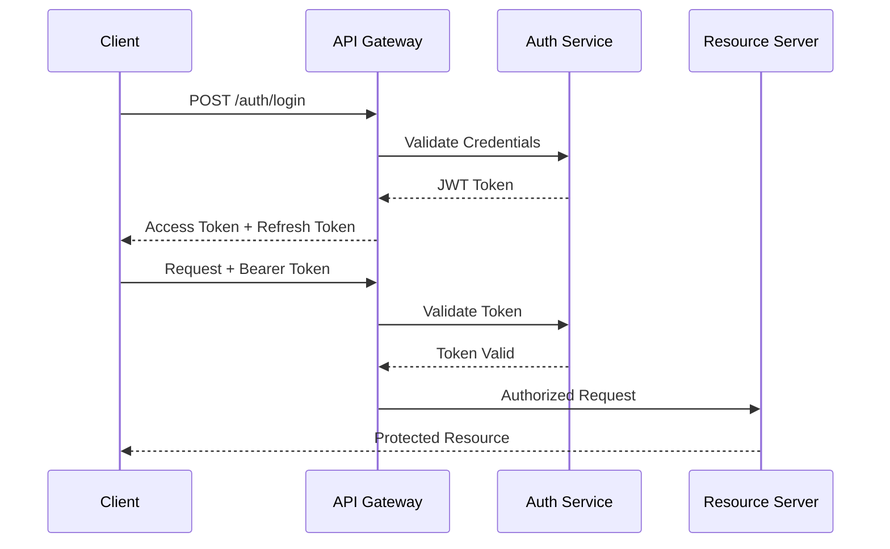

## 8.4 Security Design

### 8.4.1 Authentication Flow

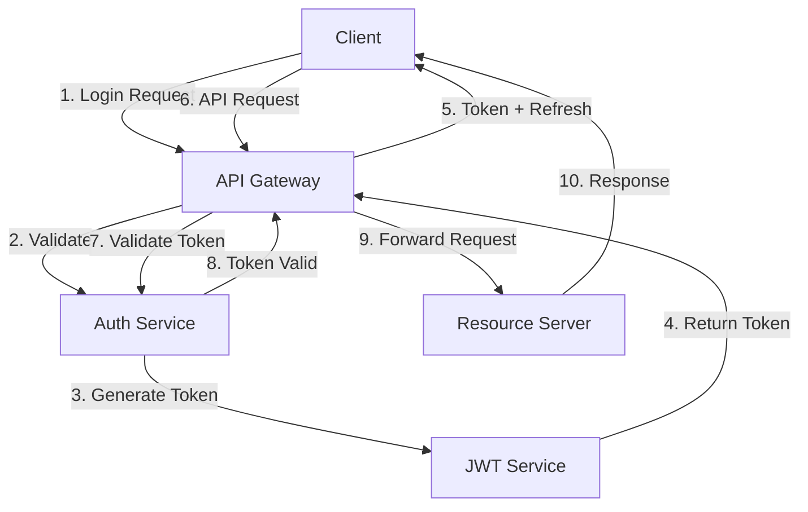

### 8.4.2 Data Encryption

| Layer | Encryption Method | Key Management |
|-------|------------------|----------------|
| Transport | TLS 1.3 | AWS Certificate Manager |
| Database | AES-256 | AWS KMS |
| File Storage | AES-256 | AWS KMS |
| API Payload | JWE | RSA Key Pairs |
| Sensitive Fields | Field-level encryption | Application Keys |

# 8.1 User Interface Design

## 8.1.1 Design System Key

```
Icons:
[?] - Help/Information tooltip
[$] - Financial transaction/amount
[i] - Information
[+] - Add new item
[x] - Close/Delete
[<] [>] - Navigation
[^] - Upload/Sync
[#] - Dashboard menu
[@] - User profile
[!] - Alert/Warning
[=] - Settings menu
[*] - Favorite/Important

Interactive Elements:
[ ] - Checkbox
( ) - Radio button
[Button] - Clickable button
[...] - Text input field
[====] - Progress bar
[v] - Dropdown menu

Layout Elements:
+--+ - Container border
|  | - Vertical separator
+-- - Hierarchical relationship
```

## 8.1.2 Main Dashboard

```
+------------------------------------------+
|  [@] Profile    [#] Dashboard    [=]     |
+------------------------------------------+
|                                          |
|  Net Worth: $52,340.25         [^] Sync  |
|  [============================] 85%      |
|                                          |
|  +----------------------------------+    |
|  | Accounts Overview           [$]   |    |
|  | Checking         $2,340.25       |    |
|  | Savings          $15,000.00      |    |
|  | Credit Card     -$525.75    [>]  |    |
|  | Investment      $35,525.75       |    |
|  +----------------------------------+    |
|                                          |
|  +----------------------------------+    |
|  | Budget Status             [!]    |    |
|  | Groceries    [========] 80%      |    |
|  | Transport    [====] 40%          |    |
|  | Shopping     [============] !95%  |    |
|  +----------------------------------+    |
|                                          |
|  Recent Transactions          [+] Add    |
|  +----------------------------------+    |
|  | Walmart         -$52.25          |    |
|  | Target          -$125.75         |    |
|  | Salary         +$2,500.00        |    |
|  +----------------------------------+    |
|                                          |
+------------------------------------------+
```

## 8.1.3 Account Details View

```
+------------------------------------------+
|  [<] Back                    [=] Filter  |
+------------------------------------------+
|                                          |
|  Checking Account                        |
|  Balance: $2,340.25            [$]      |
|                                          |
|  Search: [............................]  |
|                                          |
|  Filter by: [v] All Categories          |
|  Sort by:   [v] Date (newest first)     |
|                                          |
|  +----------------------------------+    |
|  | Mar 15  Walmart                  |    |
|  | Category: Groceries   -$52.25    |    |
|  | [i] Pending                      |    |
|  +----------------------------------+    |
|  | Mar 14  Target                   |    |
|  | Category: Shopping   -$125.75    |    |
|  | [*] Recurring                    |    |
|  +----------------------------------+    |
|  | Mar 13  Salary                   |    |
|  | Category: Income    +$2,500.00   |    |
|  +----------------------------------+    |
|                                          |
|  [Load More Transactions]                |
|                                          |
+------------------------------------------+
```

## 8.1.4 Budget Creation/Edit

```
+------------------------------------------+
|  [<] Back    Create Budget    [?]        |
+------------------------------------------+
|                                          |
|  Budget Name: [......................]   |
|                                          |
|  Period:                                 |
|  ( ) Monthly                             |
|  ( ) Weekly                              |
|  ( ) Custom                              |
|                                          |
|  Categories:                             |
|  [+] Add Category                        |
|                                          |
|  +----------------------------------+    |
|  | Groceries                        |    |
|  | Amount: [$750.00]                |    |
|  | [========] $600 spent            |    |
|  | [x] Remove                       |    |
|  +----------------------------------+    |
|  | Transport                        |    |
|  | Amount: [$200.00]                |    |
|  | [====] $80 spent                 |    |
|  | [x] Remove                       |    |
|  +----------------------------------+    |
|                                          |
|  [Save Budget]    [Cancel]               |
|                                          |
+------------------------------------------+
```

## 8.1.5 Investment Dashboard

```
+------------------------------------------+
|  [<] Back    Investments    [=]          |
+------------------------------------------+
|                                          |
|  Total Value: $35,525.75                 |
|  Return: +5.2% [==========] YTD          |
|                                          |
|  Asset Allocation:                       |
|  +----------------------------------+    |
|  | Stocks     [===========] 55%     |    |
|  | Bonds      [======] 30%          |    |
|  | Cash       [===] 15%             |    |
|  +----------------------------------+    |
|                                          |
|  Holdings:                [v] Sort by    |
|  +----------------------------------+    |
|  | AAPL - Apple Inc.               |    |
|  | 10 shares @ $175.25             |    |
|  | Value: $1,752.50  [+2.5%]       |    |
|  +----------------------------------+    |
|  | VTI - Vanguard Total Stock      |    |
|  | 25 shares @ $220.75             |    |
|  | Value: $5,518.75  [+1.8%]       |    |
|  +----------------------------------+    |
|                                          |
|  [View Full Portfolio]                   |
|                                          |
+------------------------------------------+
```

## 8.1.6 Navigation Flow

```
+----------------+     +----------------+
| Login Screen   |---->| Dashboard     |
+----------------+     +----------------+
                          |   |    |
            +------------+    |    +-------------+
            |                 |                  |
    +----------------+ +----------------+ +----------------+
    | Account Detail | | Budget Manager | | Investments   |
    +----------------+ +----------------+ +----------------+
            |                 |                  |
    +----------------+ +----------------+ +----------------+
    | Transactions   | | Create Budget | | Holdings Detail|
    +----------------+ +----------------+ +----------------+
```

## 8.1.7 Mobile Responsive Considerations

- All views adapt to screen sizes from 320px to 2048px width
- Stack elements vertically on narrow screens
- Maintain minimum touch target size of 44x44 points
- Show/hide elements based on screen real estate
- Use bottom navigation bar on mobile devices
- Implement swipe gestures for common actions
- Support both portrait and landscape orientations

## 8.1.8 Accessibility Features

- High contrast mode support
- Minimum text size of 16sp
- Touch targets minimum 44x44 points
- Screen reader compatibility
- Keyboard navigation support
- Color-blind friendly palette
- Focus indicators for navigation
- Alternative text for all icons and images

# 9. Security Considerations

## 9.1 Authentication and Authorization

### 9.1.1 Authentication Methods

| Method | Implementation | Use Case |
|--------|----------------|-----------|
| Email/Password | - Bcrypt password hashing (cost factor 12)<br>- Minimum 12 character password requirement<br>- Password complexity rules enforced | Primary authentication method |
| Biometric | - iOS Face ID/Touch ID<br>- Android Biometric API<br>- FIDO2 compliance | Quick access on mobile devices |
| Multi-Factor | - Time-based OTP (TOTP)<br>- SMS backup codes<br>- Email verification codes | High-risk operations |
| OAuth 2.0 | - JWT tokens with RS256 signing<br>- 15-minute access token expiry<br>- 7-day refresh token rotation | API authentication |

### 9.1.2 Authorization Model

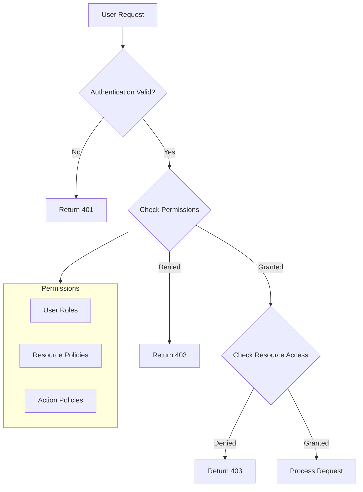

### 9.1.3 Session Management

| Component | Implementation |
|-----------|----------------|
| Session Tokens | JWT with encrypted payload |
| Token Storage | Secure keychain/keystore |
| Session Length | 15-minute active session |
| Refresh Process | Silent token refresh with sliding expiration |
| Concurrent Sessions | Maximum 3 active devices |

## 9.2 Data Security

### 9.2.1 Encryption Standards

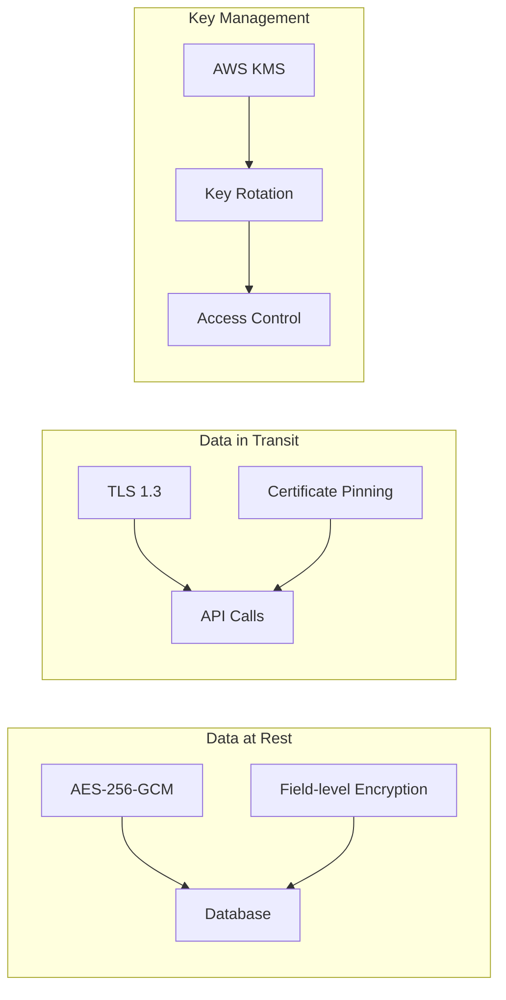

### 9.2.2 Data Classification

| Classification | Examples | Security Controls |
|----------------|----------|-------------------|
| Critical | - Account credentials<br>- Banking tokens<br>- OAuth secrets | - Field-level encryption<br>- Restricted access<br>- Audit logging |
| Sensitive | - Transaction data<br>- Account balances<br>- Personal info | - Database encryption<br>- Access controls<br>- Data masking |
| Internal | - Analytics data<br>- Usage metrics<br>- App settings | - Standard encryption<br>- Role-based access |
| Public | - App content<br>- Marketing data<br>- Help articles | - Integrity checks<br>- Version control |

## 9.3 Security Protocols

### 9.3.1 API Security

```mermaid
flowchart TD
    A[API Request] --> B[Rate Limiting]
    B --> C[WAF]
    C --> D[API Gateway]
    D --> E[Authentication]
    E --> F[Authorization]
    F --> G[Input Validation]
    G --> H[Business Logic]
    
    subgraph Security Controls
        I[DDoS Protection]
        J[SQL Injection Prevention]
        K[XSS Prevention]
        L[CSRF Protection]
    end
    
    C --> Security Controls
```

### 9.3.2 Security Monitoring

| Component | Implementation | Frequency |
|-----------|----------------|-----------|
| Access Logs | CloudWatch Logs | Real-time |
| Security Events | AWS GuardDuty | Continuous |
| Vulnerability Scanning | AWS Inspector | Daily |
| Penetration Testing | Third-party service | Quarterly |
| Security Audits | SOC 2 compliance | Annual |

### 9.3.3 Incident Response

```mermaid
flowchart LR
    A[Detection] --> B[Classification]
    B --> C[Containment]
    C --> D[Eradication]
    D --> E[Recovery]
    E --> F[Lessons Learned]
    
    subgraph Response Team
        G[Security Team]
        H[DevOps Team]
        I[Legal Team]
    end
    
    C --> Response Team
```

### 9.3.4 Compliance Controls

| Requirement | Implementation |
|-------------|----------------|
| GDPR | - Data minimization<br>- Right to erasure<br>- Privacy by design |
| PSD2 | - Strong customer authentication<br>- Secure communication<br>- Transaction monitoring |
| SOC 2 | - Access controls<br>- Encryption standards<br>- Audit logging |
| CCPA | - Data inventory<br>- Privacy notices<br>- User rights management |

### 9.3.5 Secure Development

| Phase | Security Controls |
|-------|------------------|
| Development | - SAST tools<br>- Dependency scanning<br>- Code review requirements |
| Build | - Container scanning<br>- Artifact signing<br>- Security testing |
| Deployment | - Infrastructure scanning<br>- Configuration validation<br>- Secret rotation |
| Runtime | - RASP protection<br>- Runtime scanning<br>- Behavioral monitoring |

# 10. Infrastructure

## 10.1 Deployment Environment

The Mint Replica Lite system will utilize a cloud-native deployment model to ensure scalability, reliability, and cost-effectiveness.

```mermaid
flowchart TB
    subgraph Production Environment
        direction TB
        ProdVPC[Production VPC]
        ProdApp[Production Cluster]
        ProdDB[(Production Database)]
        ProdCache[(Production Cache)]
    end
    
    subgraph Staging Environment
        direction TB
        StageVPC[Staging VPC]
        StageApp[Staging Cluster]
        StageDB[(Staging Database)]
        StageCache[(Staging Cache)]
    end
    
    subgraph Development Environment
        direction TB
        DevVPC[Development VPC]
        DevApp[Development Cluster]
        DevDB[(Development Database)]
        DevCache[(Development Cache)]
    end

    CDN[CloudFront CDN] --> ProdVPC
    WAF[AWS WAF] --> CDN
    
    Users --> WAF
```

| Environment | Purpose | Scaling Strategy |
|-------------|---------|------------------|
| Production | Live user traffic | Auto-scaling with min 3 nodes |
| Staging | Pre-production testing | Fixed 2 node deployment |
| Development | Development testing | Single node deployment |

## 10.2 Cloud Services

### 10.2.1 AWS Service Configuration

| Service | Purpose | Configuration |
|---------|---------|---------------|
| EKS | Container orchestration | v1.24+, managed node groups |
| RDS | PostgreSQL database | Multi-AZ, r6g.xlarge instances |
| ElastiCache | Redis caching | Cluster mode, r6g.large nodes |
| S3 | Object storage | Standard tier with lifecycle policies |
| CloudFront | CDN | Edge locations with custom domain |
| Route53 | DNS management | Health checks, failover routing |
| WAF | Web application firewall | Custom rules and rate limiting |
| KMS | Key management | Automatic key rotation |

### 10.2.2 Network Architecture

```mermaid
flowchart TB
    subgraph VPC
        direction TB
        subgraph Public Subnets
            ALB[Application Load Balancer]
            NAT[NAT Gateway]
        end
        
        subgraph Private Subnets
            EKS[EKS Cluster]
            RDS[(RDS Database)]
            Redis[(ElastiCache)]
        end
    end
    
    Internet --> CloudFront
    CloudFront --> WAF
    WAF --> ALB
    ALB --> EKS
    EKS --> RDS
    EKS --> Redis
    EKS --> NAT
    NAT --> Internet
```

## 10.3 Containerization

### 10.3.1 Docker Configuration

| Component | Base Image | Size Optimization |
|-----------|------------|------------------|
| API Server | node:16-alpine | Multi-stage builds |
| Background Workers | node:16-alpine | Multi-stage builds |
| Monitoring Tools | grafana/grafana:latest | Official image |
| Cache Manager | redis:6-alpine | Official image |

### 10.3.2 Container Resource Limits

| Container | CPU Limit | Memory Limit | Replicas |
|-----------|-----------|--------------|----------|
| API Server | 1 CPU | 2Gi | 3-10 |
| Worker | 2 CPU | 4Gi | 2-5 |
| Monitoring | 0.5 CPU | 1Gi | 1 |
| Cache | 2 CPU | 4Gi | 3 |

## 10.4 Orchestration

### 10.4.1 Kubernetes Configuration

```mermaid
flowchart TB
    subgraph Kubernetes Cluster
        direction TB
        subgraph System Pods
            Ingress[Ingress Controller]
            Metrics[Metrics Server]
            Logging[Logging Agent]
        end
        
        subgraph Application Pods
            API[API Servers]
            Workers[Background Workers]
            Cache[Cache Servers]
        end
        
        subgraph Storage
            PVC[Persistent Volumes]
        end
    end
    
    Ingress --> API
    API --> Workers
    API --> Cache
    Workers --> PVC
```

### 10.4.2 Kubernetes Resources

| Resource | Configuration | Scaling Policy |
|----------|--------------|----------------|
| Deployments | Rolling updates | HPA based on CPU/Memory |
| Services | ClusterIP/LoadBalancer | Internal service discovery |
| ConfigMaps | Environment configs | Version controlled |
| Secrets | Sensitive data | AWS Secrets Manager integration |
| PersistentVolumes | EBS backed | Automatic provisioning |

## 10.5 CI/CD Pipeline

### 10.5.1 Pipeline Architecture

```mermaid
flowchart LR
    subgraph Source
        Git[GitHub Repository]
    end
    
    subgraph Build
        Test[Unit Tests]
        Lint[Code Linting]
        Build[Docker Build]
    end
    
    subgraph Deploy
        Dev[Development]
        Stage[Staging]
        Prod[Production]
    end
    
    Git --> Test
    Test --> Lint
    Lint --> Build
    Build --> Dev
    Dev --> Stage
    Stage --> Prod
```

### 10.5.2 GitHub Actions Workflow

| Stage | Actions | Success Criteria |
|-------|---------|------------------|
| Build | - Run unit tests<br>- Static code analysis<br>- Security scanning | All tests pass, no critical vulnerabilities |
| Package | - Build Docker images<br>- Push to ECR | Successful build and push |
| Deploy Dev | - Update EKS manifests<br>- Apply changes | Deployment successful, health checks pass |
| Deploy Stage | - Integration tests<br>- Performance tests | Tests pass, performance metrics met |
| Deploy Prod | - Blue/green deployment<br>- Smoke tests | Zero-downtime deployment, all tests pass |

### 10.5.3 Deployment Strategy

```mermaid
flowchart TB
    subgraph Blue-Green Deployment
        direction LR
        Blue[Blue Environment]
        Green[Green Environment]
        Router[Load Balancer]
        
        Router --> Blue
        Router -.-> Green
    end
    
    subgraph Rollback
        Monitor[Health Monitoring]
        Alarm[Alerts]
        
        Monitor --> Alarm
        Alarm --> Router
    end
```

| Phase | Actions | Validation |
|-------|---------|------------|
| Pre-deployment | - Verify dependencies<br>- Check resource availability | All checks pass |
| Deployment | - Update green environment<br>- Run smoke tests<br>- Switch traffic | Zero errors |
| Post-deployment | - Monitor metrics<br>- Verify functionality<br>- Cleanup old version | Performance normal |
| Rollback | - Switch to blue environment<br>- Investigate issues<br>- Alert team | < 5 minute RTO |

# APPENDICES

## A.1 Additional Technical Information

### A.1.1 Development Environment Setup

| Component | Tool/Version | Purpose |
|-----------|-------------|----------|
| IDE | VS Code 1.75+ | Primary development environment |
| Mobile Development | Xcode 14+, Android Studio Electric Eel+ | Native app development |
| Version Control | Git 2.39+ | Source code management |
| Package Management | npm 8+, CocoaPods 1.11+, Gradle 7.5+ | Dependency management |
| API Testing | Postman 10+, Swagger UI | API development and testing |
| Database Tools | pgAdmin 4, Redis Commander | Database management |

### A.1.2 Code Quality Standards

```mermaid
flowchart LR
    subgraph Quality Gates
        A[Static Analysis] --> B[Unit Tests]
        B --> C[Integration Tests]
        C --> D[Security Scan]
        D --> E[Performance Tests]
    end

    subgraph Metrics
        F[Code Coverage >80%]
        G[Complexity <15]
        H[Duplication <3%]
        I[Tech Debt <8h]
    end

    Quality Gates --> Metrics
```

### A.1.3 Error Handling Standards

| Error Type | Handling Approach | User Experience |
|------------|------------------|-----------------|
| Network Errors | Retry with exponential backoff | Offline mode activation |
| Authentication Failures | Token refresh attempt | Re-authentication prompt |
| API Errors | Graceful degradation | User-friendly error message |
| Data Validation | Client-side validation first | Immediate feedback |
| System Errors | Fallback to cached data | Transparent error notification |

## A.2 GLOSSARY

| Term | Definition |
|------|------------|
| API Gateway | Entry point for all API requests that handles routing, authentication, and rate limiting |
| Blue-Green Deployment | Deployment strategy using two identical environments for zero-downtime updates |
| Circuit Breaker | Design pattern that prevents cascading failures in distributed systems |
| Data Aggregation | Process of collecting and combining data from multiple sources |
| Horizontal Scaling | Adding more machines to handle increased load |
| JWT | JSON Web Token used for secure transmission of information between parties |
| Microservices | Architectural style structuring an application as a collection of loosely coupled services |
| OAuth 2.0 | Industry-standard protocol for authorization |
| Rate Limiting | Controlling the rate of requests a user can make to an API |
| Redis Cluster | Distributed implementation of Redis for high availability and scalability |
| Vertical Scaling | Adding more resources to existing machines |
| WebSocket | Protocol providing full-duplex communication channels over TCP |

## A.3 ACRONYMS

| Acronym | Full Form |
|---------|-----------|
| APNS | Apple Push Notification Service |
| AWS | Amazon Web Services |
| CDK | Cloud Development Kit |
| CDN | Content Delivery Network |
| CI/CD | Continuous Integration/Continuous Deployment |
| EKS | Elastic Kubernetes Service |
| FCM | Firebase Cloud Messaging |
| GDPR | General Data Protection Regulation |
| HA | High Availability |
| IAM | Identity and Access Management |
| JWT | JSON Web Token |
| K8s | Kubernetes |
| KMS | Key Management Service |
| MTBF | Mean Time Between Failures |
| MTTR | Mean Time To Recovery |
| ORM | Object-Relational Mapping |
| RASP | Runtime Application Self-Protection |
| REST | Representational State Transfer |
| RTO | Recovery Time Objective |
| SAST | Static Application Security Testing |
| SDK | Software Development Kit |
| SLA | Service Level Agreement |
| SOC | Service Organization Control |
| SSL | Secure Sockets Layer |
| TLS | Transport Layer Security |
| VPC | Virtual Private Cloud |
| WAF | Web Application Firewall |
| WCAG | Web Content Accessibility Guidelines |

## A.4 Development Standards Reference

```mermaid
flowchart TD
    subgraph Code Standards
        A[TypeScript Style Guide]
        B[Swift Style Guide]
        C[Kotlin Style Guide]
    end

    subgraph Testing Standards
        D[Unit Test Coverage]
        E[Integration Test Patterns]
        F[E2E Test Scenarios]
    end

    subgraph Documentation
        G[API Documentation]
        H[Code Documentation]
        I[Architecture Diagrams]
    end

    subgraph Security Standards
        J[OWASP Guidelines]
        K[Security Testing]
        L[Code Scanning]
    end

    Code Standards --> Testing Standards
    Testing Standards --> Documentation
    Documentation --> Security Standards
```