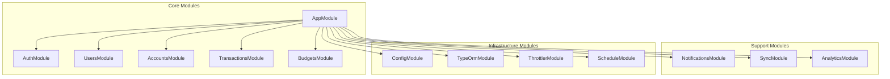
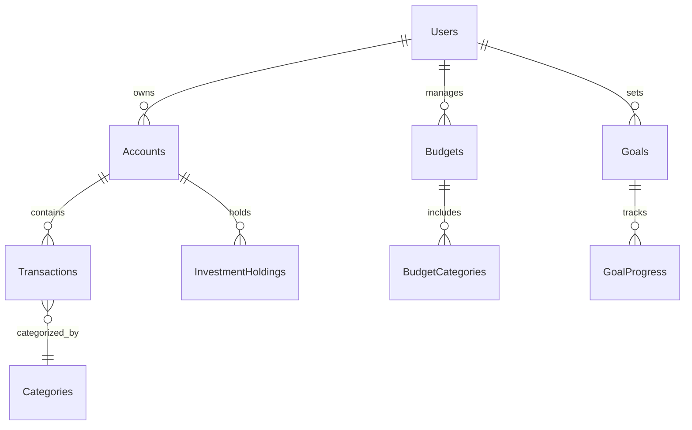

# Mint Replica Lite Backend Architecture Documentation

<!-- Human Tasks:
1. Review and validate all security configurations against company security policies
2. Configure monitoring alerts for critical system components
3. Set up backup and disaster recovery procedures
4. Configure production environment variables
5. Set up SSL certificates and domain configurations
6. Configure cloud infrastructure access controls
7. Set up logging and monitoring dashboards
8. Review and approve rate limiting thresholds -->

## Table of Contents
1. [System Overview](#system-overview)
2. [Component Architecture](#component-architecture)
3. [Data Architecture](#data-architecture)
4. [Security Architecture](#security-architecture)
5. [API Architecture](#api-architecture)
6. [Deployment Architecture](#deployment-architecture)

## 1. System Overview

### High-Level Architecture Diagram

```mermaid
flowchart TB
    subgraph Client Layer
        iOS[iOS App]
        Android[Android App]
        Web[Web App]
    end

    subgraph API Gateway Layer
        ALB[Application Load Balancer]
        WAF[AWS WAF]
        API[API Gateway]
    end

    subgraph Service Layer
        Auth[Authentication Service]
        Users[Users Service]
        Accounts[Accounts Service]
        Trans[Transactions Service]
        Budget[Budget Service]
        Invest[Investment Service]
        Goals[Goals Service]
        Notif[Notification Service]
        Sync[Data Sync Service]
    end

    subgraph Data Layer
        DB[(PostgreSQL)]
        Cache[(Redis)]
        Queue[Message Queue]
        S3[AWS S3]
    end

    subgraph External Services
        Plaid[Plaid API]
        Push[Push Notifications]
        Monitor[Monitoring Stack]
    end

    Client Layer --> WAF
    WAF --> ALB
    ALB --> API
    API --> Service Layer
    Service Layer --> Data Layer
    Service Layer --> External Services
```

### Technology Stack
- **Runtime Environment**: Node.js 16+ with NestJS 9.0.0
- **Database**: PostgreSQL 14+ with TypeORM
- **Caching**: Redis 6+ for session and data caching
- **API Documentation**: OpenAPI/Swagger 6.0.0
- **Security**: Helmet, JWT, CORS, Rate Limiting
- **Monitoring**: Prometheus & Grafana
- **Cloud Platform**: AWS (EKS, RDS, ElastiCache)
- **Container Orchestration**: Kubernetes with EKS

## 2. Component Architecture

### Module Organization



### Service Layer Design
- **Dependency Injection Pattern**: NestJS's built-in DI container
- **Service Isolation**: Each module contains its own services
- **Business Logic**: Encapsulated in service classes
- **Cross-Cutting Concerns**: Handled by middleware and interceptors

### Repository Pattern Implementation
```typescript
// Example repository pattern structure
interface IRepository<T> {
    findOne(id: string): Promise<T>;
    findAll(criteria: any): Promise<T[]>;
    create(entity: T): Promise<T>;
    update(id: string, entity: Partial<T>): Promise<T>;
    delete(id: string): Promise<void>;
}

// Implementation using TypeORM
class BaseRepository<T> implements IRepository<T> {
    constructor(private readonly repository: Repository<T>) {}
    // Implementation details...
}
```

### Error Handling Strategies
1. **Global Exception Filter**: Standardized error responses
2. **Custom Domain Exceptions**: Business logic specific errors
3. **HTTP Exception Handling**: REST API error standards
4. **Database Error Handling**: TypeORM error mapping
5. **Validation Errors**: Class-validator integration

## 3. Data Architecture

### Database Schema Design



### Data Flow Patterns
1. **Write Operations**:
   - Input validation
   - Business logic validation
   - Transaction management
   - Cache invalidation
   - Event emission

2. **Read Operations**:
   - Cache check
   - Database query
   - Response transformation
   - Data aggregation
   - Cache update

### Caching Strategy
```typescript
// Redis caching configuration
const cacheConfig = {
    store: redisStore,
    host: process.env.REDIS_HOST,
    port: process.env.REDIS_PORT,
    ttl: 3600, // 1 hour default TTL
    max: 100 // Maximum number of items in cache
};
```

### Data Migration Approach
- **Tool**: TypeORM migrations
- **Strategy**: Version controlled, reversible migrations
- **Deployment**: Automated migration runs
- **Rollback**: Automated rollback procedures
- **Data Backup**: Daily S3 backups

## 4. Security Architecture

### JWT Authentication Implementation
```typescript
// JWT configuration
const jwtConfig = {
    secret: process.env.JWT_SECRET,
    signOptions: {
        expiresIn: '15m',
        algorithm: 'RS256'
    },
    verifyOptions: {
        algorithms: ['RS256']
    }
};
```

### Role-Based Authorization
```typescript
// Role definitions
enum UserRole {
    USER = 'user',
    ADMIN = 'admin',
    PREMIUM = 'premium'
}

// Role guard implementation
@Injectable()
class RolesGuard implements CanActivate {
    canActivate(context: ExecutionContext): boolean {
        // Role validation logic
    }
}
```

### Security Middleware Configuration
```typescript
// Helmet security configuration
app.use(helmet({
    contentSecurityPolicy: {
        directives: {
            defaultSrc: ["'self'"],
            scriptSrc: ["'self'"],
            styleSrc: ["'self'"],
            imgSrc: ["'self'", 'data:', 'https:'],
            connectSrc: ["'self'", 'https://*.mintreplica.com']
        }
    },
    crossOriginEmbedderPolicy: true,
    crossOriginResourcePolicy: true
}));
```

### Rate Limiting Implementation
```typescript
// Rate limiting configuration
ThrottlerModule.forRoot({
    ttl: 60, // Time window in seconds
    limit: 100 // Requests per window
})
```

## 5. API Architecture

### REST API Design Patterns
- **Resource-Based URLs**: Clear hierarchy and naming
- **HTTP Methods**: Proper verb usage
- **Status Codes**: Standard HTTP status codes
- **Query Parameters**: Filtering and pagination
- **Response Envelope**: Consistent response format

### OpenAPI/Swagger Documentation
```typescript
// Swagger configuration
const swaggerConfig = new DocumentBuilder()
    .setTitle('Mint Replica Lite API')
    .setDescription('Financial management system API')
    .setVersion('1.0')
    .addBearerAuth()
    .build();
```

### Request Validation
```typescript
// DTO validation example
class CreateTransactionDto {
    @IsNotEmpty()
    @IsString()
    accountId: string;

    @IsNumber()
    @Min(0)
    amount: number;

    @IsDateString()
    date: string;

    @IsString()
    @MaxLength(255)
    description: string;
}
```

### API Gateway Integration
```typescript
// AWS API Gateway integration
const apiGatewayConfig = {
    cors: {
        allowedOrigins: ['https://*.mintreplica.com'],
        allowedMethods: ['GET', 'POST', 'PUT', 'DELETE', 'PATCH'],
        allowedHeaders: ['Content-Type', 'Authorization'],
        maxAge: 3600
    },
    rateLimit: {
        burstLimit: 200,
        rateLimit: 100
    }
};
```

## 6. Deployment Architecture

### Docker Containerization
```dockerfile
# Multi-stage build example
FROM node:16-alpine AS builder
WORKDIR /app
COPY package*.json ./
RUN npm ci
COPY . .
RUN npm run build

FROM node:16-alpine
WORKDIR /app
COPY --from=builder /app/dist ./dist
COPY --from=builder /app/node_modules ./node_modules
EXPOSE 3000
CMD ["node", "dist/main"]
```

### Kubernetes Orchestration
```yaml
# Deployment configuration
apiVersion: apps/v1
kind: Deployment
metadata:
  name: mint-replica-api
spec:
  replicas: 3
  selector:
    matchLabels:
      app: mint-replica-api
  template:
    metadata:
      labels:
        app: mint-replica-api
    spec:
      containers:
      - name: api
        image: mint-replica-api:latest
        resources:
          limits:
            cpu: "1"
            memory: "1Gi"
          requests:
            cpu: "500m"
            memory: "512Mi"
```

### Horizontal Pod Autoscaling
```yaml
# HPA configuration
apiVersion: autoscaling/v2
kind: HorizontalPodAutoscaler
metadata:
  name: mint-replica-api-hpa
spec:
  scaleTargetRef:
    apiVersion: apps/v1
    kind: Deployment
    name: mint-replica-api
  minReplicas: 3
  maxReplicas: 10
  metrics:
  - type: Resource
    resource:
      name: cpu
      target:
        type: Utilization
        averageUtilization: 70
```

### Monitoring Stack
```yaml
# Prometheus monitoring configuration
apiVersion: monitoring.coreos.com/v1
kind: ServiceMonitor
metadata:
  name: mint-replica-api
spec:
  selector:
    matchLabels:
      app: mint-replica-api
  endpoints:
  - port: metrics
    interval: 15s
    path: /metrics
```

### CI/CD Pipeline
```yaml
# GitHub Actions workflow
name: API Deployment
on:
  push:
    branches: [main]
jobs:
  deploy:
    runs-on: ubuntu-latest
    steps:
      - uses: actions/checkout@v2
      - name: Build and test
        run: |
          npm ci
          npm test
      - name: Build Docker image
        run: docker build -t mint-replica-api .
      - name: Deploy to EKS
        run: |
          aws eks update-kubeconfig --region us-east-1 --name mint-replica-cluster
          kubectl apply -f k8s/
```

## References
- [NestJS Documentation](https://docs.nestjs.com/)
- [TypeORM Documentation](https://typeorm.io/)
- [Kubernetes Documentation](https://kubernetes.io/docs/)
- [AWS EKS Documentation](https://docs.aws.amazon.com/eks/)
- Technical Specification/5.1 High-Level Architecture Overview
- Technical Specification/5.4 Security Architecture
- Technical Specification/5.2.4 Data Architecture
- Technical Specification/8.3 API Design