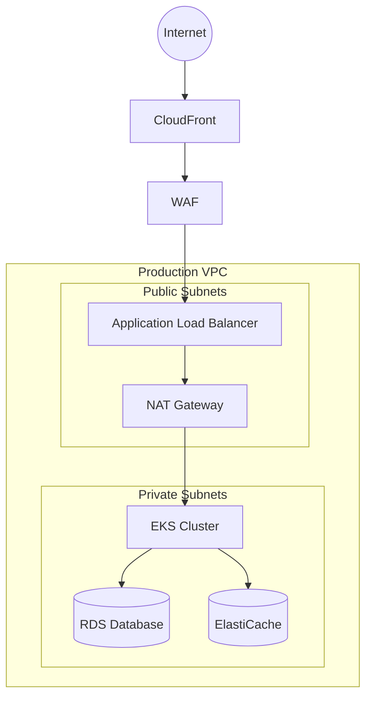

# Mint Replica Lite Backend Deployment Guide

<!-- Human Tasks:
1. Verify AWS account access and permissions for EKS, RDS, ElastiCache, and other services
2. Configure DNS records for api.mintreplica.com
3. Set up SSL certificates in AWS Certificate Manager
4. Create AWS WAF web ACL with required rules
5. Configure GitHub repository secrets for CI/CD
6. Set up monitoring alerts in CloudWatch
7. Configure backup retention policies
8. Review and customize resource quotas
9. Set up logging aggregation in ELK stack
10. Verify network security groups and VPC settings -->

## Infrastructure Overview

### AWS Cloud Infrastructure

<!-- Requirement: Infrastructure Setup
     Location: Technical Specification/10. Infrastructure
     Description: Details AWS cloud infrastructure components and network architecture -->

The Mint Replica Lite backend is deployed on AWS using the following core services:

- **Amazon EKS**: Kubernetes cluster for container orchestration
- **Amazon RDS**: PostgreSQL database with Multi-AZ deployment
- **Amazon ElastiCache**: Redis cluster for caching and session management
- **Amazon S3**: Object storage for backups and static assets
- **Amazon CloudFront**: CDN for static content delivery
- **AWS WAF**: Web Application Firewall for security
- **AWS Route53**: DNS management and health checks

Network Architecture:


### Resource Requirements

<!-- Requirement: Container Orchestration
     Location: Technical Specification/10.4 Orchestration
     Description: Resource management specifications -->

| Component | CPU | Memory | Storage | Replicas |
|-----------|-----|---------|----------|-----------|
| API Server | 1-2 cores | 2-4GB | 20GB | 3-10 |
| Worker Nodes | 2 cores | 4GB | 50GB | 2-5 |
| PostgreSQL | 4 cores | 16GB | 100GB | 2 (Multi-AZ) |
| Redis | 2 cores | 8GB | N/A | 3 (Cluster) |

## Prerequisites

### Required Tools

```bash
# Required CLI tools and versions
aws-cli >= 2.0.0
kubectl >= 1.24.0
helm >= 3.8.0
docker >= 20.10.0
eksctl >= 0.95.0
```

### AWS Configuration

```bash
# Configure AWS CLI
aws configure set region us-west-2
aws configure set output json

# Verify AWS authentication
aws sts get-caller-identity
```

### Environment Variables

```bash
# Core environment variables
export AWS_REGION=us-west-2
export CLUSTER_NAME=mint-replica-prod
export NAMESPACE=mint-replica

# Application configuration
export NODE_ENV=production
export APP_VERSION=1.0.0
export MIN_REPLICAS=3
export MAX_REPLICAS=10
```

## Deployment Environments

<!-- Requirement: Deployment Architecture
     Location: Technical Specification/5.6 Deployment Architecture
     Description: Environment configurations and deployment strategy -->

### Development Environment

```bash
# Create development namespace
kubectl create namespace mint-replica-dev

# Deploy single-node configuration
kubectl apply -f kubernetes/dev/ -n mint-replica-dev
```

### Staging Environment

```bash
# Create staging namespace
kubectl create namespace mint-replica-staging

# Deploy 2-node configuration
kubectl apply -f kubernetes/staging/ -n mint-replica-staging
```

### Production Environment

```bash
# Create production namespace
kubectl create namespace mint-replica-prod

# Deploy production configuration with auto-scaling
kubectl apply -f kubernetes/prod/ -n mint-replica-prod
```

## Container Configuration

### Docker Image Build

```dockerfile
# Base image configuration
FROM node:16-alpine

# Set working directory
WORKDIR /app

# Copy package files
COPY package*.json ./

# Install dependencies
RUN npm ci --only=production

# Copy application code
COPY . .

# Build application
RUN npm run build

# Set user for security
USER node

# Start application
CMD ["npm", "run", "start:prod"]
```

### Image Registry Setup

```bash
# Configure ECR authentication
aws ecr get-login-password --region us-west-2 | docker login --username AWS --password-stdin $AWS_ACCOUNT.dkr.ecr.us-west-2.amazonaws.com

# Build and push image
docker build -t mint-replica-backend .
docker tag mint-replica-backend:latest $AWS_ACCOUNT.dkr.ecr.us-west-2.amazonaws.com/mint-replica-backend:latest
docker push $AWS_ACCOUNT.dkr.ecr.us-west-2.amazonaws.com/mint-replica-backend:latest
```

## Kubernetes Deployment

<!-- Requirement: Container Orchestration
     Location: Technical Specification/10.4 Orchestration
     Description: Kubernetes deployment and configuration -->

### EKS Cluster Setup

```bash
# Create EKS cluster
eksctl create cluster \
  --name mint-replica-prod \
  --region us-west-2 \
  --nodegroup-name standard-workers \
  --node-type t3.large \
  --nodes-min 3 \
  --nodes-max 10 \
  --with-oidc \
  --ssh-access \
  --ssh-public-key mint-replica-key \
  --managed
```

### Deploy Application Components

```bash
# Apply core Kubernetes manifests
kubectl apply -f kubernetes/base/namespace.yaml
kubectl apply -f kubernetes/base/resourcequota.yaml
kubectl apply -f kubernetes/deployment.yaml
kubectl apply -f kubernetes/service.yaml
kubectl apply -f kubernetes/ingress.yaml
```

### Health Check Configuration

```yaml
livenessProbe:
  httpGet:
    path: /health
    port: 3000
  initialDelaySeconds: 30
  periodSeconds: 10
  timeoutSeconds: 5
  failureThreshold: 3

readinessProbe:
  httpGet:
    path: /health
    port: 3000
  initialDelaySeconds: 15
  periodSeconds: 5
```

## CI/CD Pipeline

<!-- Requirement: CI/CD Pipeline
     Location: Technical Specification/10.5 CI/CD Pipeline
     Description: Automated deployment workflow -->

### GitHub Actions Workflow

```yaml
name: Deploy Backend

on:
  push:
    branches: [main]
  pull_request:
    branches: [main]

jobs:
  build:
    runs-on: ubuntu-latest
    steps:
      - uses: actions/checkout@v2
      
      - name: Configure AWS credentials
        uses: aws-actions/configure-aws-credentials@v1
        with:
          aws-access-key-id: ${{ secrets.AWS_ACCESS_KEY_ID }}
          aws-secret-access-key: ${{ secrets.AWS_SECRET_ACCESS_KEY }}
          aws-region: us-west-2
      
      - name: Build and test
        run: |
          npm ci
          npm run test
          npm run build
      
      - name: Build and push Docker image
        run: |
          docker build -t ${{ secrets.ECR_REGISTRY }}/mint-replica-backend:${{ github.sha }} .
          docker push ${{ secrets.ECR_REGISTRY }}/mint-replica-backend:${{ github.sha }}
      
      - name: Deploy to EKS
        run: |
          aws eks update-kubeconfig --name mint-replica-prod
          kubectl set image deployment/mint-replica-backend mint-replica-backend=${{ secrets.ECR_REGISTRY }}/mint-replica-backend:${{ github.sha }}
```

### Blue-Green Deployment

```bash
# Deploy new version (green)
kubectl apply -f kubernetes/deployment-green.yaml

# Verify green deployment
kubectl rollout status deployment/mint-replica-backend-green

# Switch traffic to green
kubectl patch service mint-replica-backend -p '{"spec":{"selector":{"version":"green"}}}'

# Verify and cleanup old deployment
kubectl delete deployment mint-replica-backend-blue
```

## Monitoring Setup

### Prometheus Configuration

```yaml
# prometheus.yaml
scrape_configs:
  - job_name: 'mint-replica-backend'
    kubernetes_sd_configs:
      - role: pod
    relabel_configs:
      - source_labels: [__meta_kubernetes_pod_annotation_prometheus_io_scrape]
        action: keep
        regex: true
```

### Grafana Dashboards

```bash
# Deploy Grafana
helm install grafana grafana/grafana \
  --namespace monitoring \
  --set persistence.enabled=true \
  --set adminPassword=$GRAFANA_ADMIN_PASSWORD \
  --values grafana-values.yaml
```

### Alert Rules

```yaml
# alertmanager.yaml
groups:
  - name: mint-replica-alerts
    rules:
      - alert: HighErrorRate
        expr: rate(http_requests_total{status=~"5.."}[5m]) > 0.1
        for: 5m
        labels:
          severity: critical
        annotations:
          summary: High error rate detected
```

## Backup and Recovery

### Automated Backup Configuration

```bash
# Configure automated backups
aws rds modify-db-instance \
  --db-instance-identifier mint-replica-prod \
  --backup-retention-period 30 \
  --preferred-backup-window "03:00-04:00" \
  --apply-immediately
```

### Disaster Recovery Procedure

```bash
# Initiate failover to standby
aws rds failover-db-cluster \
  --db-cluster-identifier mint-replica-prod

# Verify database status
aws rds describe-db-clusters \
  --db-cluster-identifier mint-replica-prod
```

## Security Measures

### Network Policies

```yaml
# network-policy.yaml
apiVersion: networking.k8s.io/v1
kind: NetworkPolicy
metadata:
  name: mint-replica-backend-policy
spec:
  podSelector:
    matchLabels:
      app: mint-replica-backend
  policyTypes:
    - Ingress
    - Egress
  ingress:
    - from:
        - podSelector:
            matchLabels:
              app: mint-replica-frontend
  egress:
    - to:
        - podSelector:
            matchLabels:
              app: mint-replica-database
```

### IAM Roles Configuration

```bash
# Create IAM role for service account
eksctl create iamserviceaccount \
  --cluster=mint-replica-prod \
  --namespace=mint-replica \
  --name=mint-replica-backend \
  --attach-policy-arn=arn:aws:iam::aws:policy/AWSXRayDaemonWriteAccess \
  --approve
```

### Secrets Management

```bash
# Create secrets in AWS Secrets Manager
aws secretsmanager create-secret \
  --name mint-replica/prod/db-credentials \
  --description "Database credentials for Mint Replica" \
  --secret-string '{"username":"dbuser","password":"'$DB_PASSWORD'"}'

# Mount secrets in Kubernetes
kubectl create secret generic db-credentials \
  --from-literal=username=dbuser \
  --from-literal=password=$DB_PASSWORD
```

### Security Monitoring

```yaml
# audit-policy.yaml
apiVersion: audit.k8s.io/v1
kind: Policy
rules:
  - level: RequestResponse
    resources:
      - group: ""
        resources: ["secrets", "configmaps"]
```

For more detailed information about specific components or procedures, please refer to the following documentation:

- [Infrastructure Setup Guide](../docs/infrastructure.md)
- [Security Compliance Guide](../docs/security.md)
- [Monitoring Guide](../docs/monitoring.md)
- [Disaster Recovery Procedures](../docs/disaster-recovery.md)